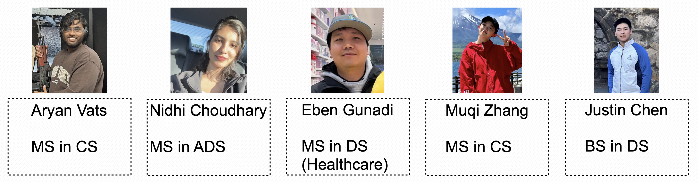

# 🚀 StreamlitAPP

  

  A Streamlit-based web application for AI-powered resume generation and enhancement, utilizing Retrieval-Augmented Generation (RAG) techniques.
  Seamlessly converts resumes between formats, retrieves best-matching templates, and generates polished, ATS-compliant documents ready for submission.

# ✨ Features

  -  📄 Parse raw resumes from PDF to structured JSON

  -  🔎 Retrieve top-matching resume templates based on job descriptions

  -  🧠 Generate optimized resume content using AI (RAG framework)

  -  📤 Export finalized resumes back into polished PDF format

  -  🖥️ Easy-to-use web interface built with Streamlit

  -  🛠️ Lightweight, fast, and customizable

# 🏗️ Project Structure

    StreamlitApp/

      ├── app.py                  # Main Streamlit application

      ├── Streamlit_UI.py          # UI components for Streamlit

      ├── convert_pdf_to_json.py   # Extracts resume content from PDFs

      ├── convert_json_to_pdf.py   # Generates PDFs from structured JSON

      ├── parse_resume.py          # Resume parsing and cleaning logic

      ├── template_retrival.py     # Retrieve templates matching JD

      ├── finetune.py              # Fine-tune prompts for better generation

      ├── resume_schema.py         # JSON schema definition for resumes

      ├── resume_template.html     # HTML template for resume layout

      ├── requirements.txt         # Python package dependencies

      └── packages.txt             # Extra environment setup

# 🚀 Quick Start

    1. Clone the repository

      git clone https://github.com/Kepler22b22/StreamlitAPP.git

      cd StreamlitAPP

    2. Install dependencies

      pip install -r requirements.txt

    3. Run the Streamlit app

      streamlit run app.py

    4. Open in Browser

      Default: http://localhost:8501/

# 🧠 Technologies Used

- [Streamlit](https://streamlit.io/)

- [OpenAI APIs](https://openai.com/)

- [Pandas](https://pandas.pydata.org/)

- [Pydantic](https://docs.pydantic.dev/)

- [PDFPlumber](https://github.com/jsvine/pdfplumber)

# 🤝 Contributing

Pull requests are welcome!

For major changes, please open an issue first to discuss what you would like to change.

# 📄 License

This project is licensed under the MIT License.
Feel free to use, modify, and distribute it with attribution.

# 🌟 Acknowledgments

Inspired by the need for faster, smarter resume generation.

# 🌟 Acknowledgments

 Inspired by the need for faster, smarter resume generation. And thanks to the incredible open-source community. Special thanks to my amazing teammates for their collaboration and dedication:

- **Aryan Vats** – MS in CS  
- **Nidhi Choudhary** – MS in ADS  
- **Eben Gunadi** – MS in DS (Healthcare)  
- **Muqi Zhang** – MS in CS  
- **Justin Chen** – BS in DS  

